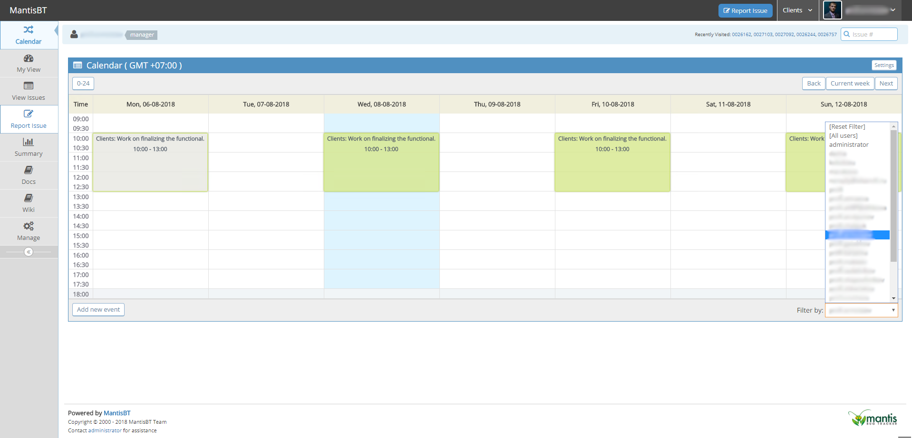
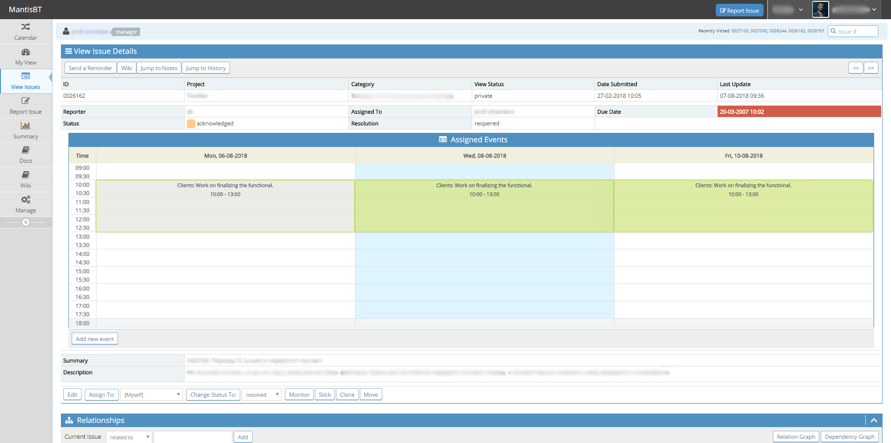
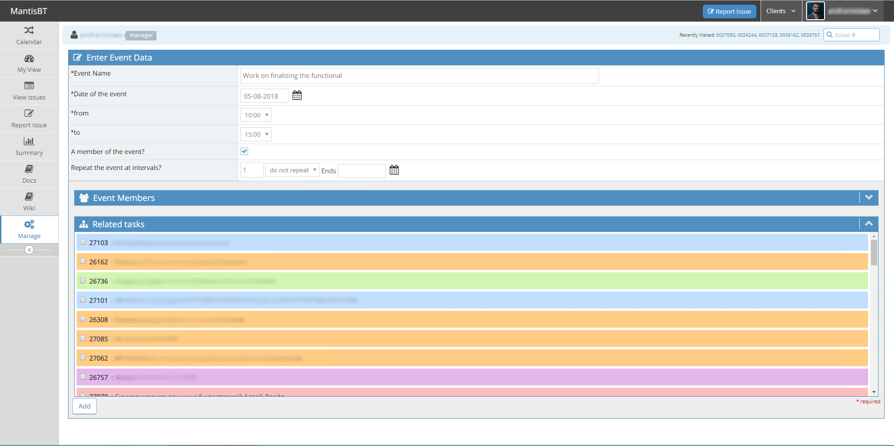
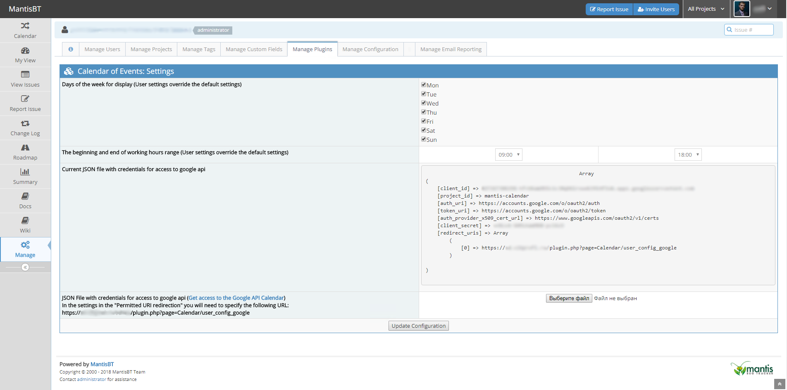
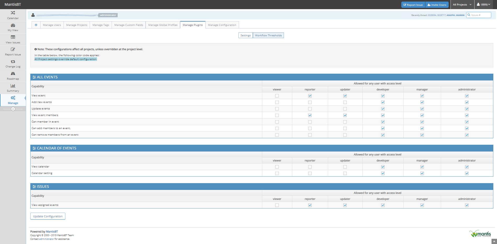

# MantisBT Calendar Plugin

Overview
--------
Adds the task scheduling function in MantisBT based on the calendar of events with the possibility of one-way synchronization with Google Calendar.

Screenshots
-----------

<!-- SCREENSHOT PLACEHOLDER (3.0.0): month view.
     Calendar page with ?view=month, a month with events on several days,
     including a day that shows the "+N more" indicator.
     Save as doc/month_view.png and uncomment the line below.

-->

<!-- SCREENSHOT PLACEHOLDER (3.0.0): day modal of the month view.
     The modal opened from a day header, listing the events of that day.
     Save as doc/month_view_day_modal.png and uncomment the line below.

-->

<!-- SCREENSHOT PLACEHOLDER (3.0.0): time range selection in the week view.
     A day column with a period selected by dragging, showing the chosen range.
     Save as doc/week_view_time_range_selection.png and uncomment the line below.

-->

<!-- SCREENSHOT PLACEHOLDER (3.0.0): time zone selector on the event form.
     The event create or edit page with the time zone select expanded.
     Save as doc/add_event_timezone_select.png and uncomment the line below.

-->

<!-- SCREENSHOT PLACEHOLDER (3.0.0): event view page of a recurring event.
     The view page showing the recurrence row and the "Created in timezone" row.
     Save as doc/view_event_with_timezone.png and uncomment the line below.

-->

Features
--------
- The ability to create event.
- Binding any number of bugs to event.
- Bug can be related to any number of events.
- Visual display of events in bugs view page.
- One-way synchronization with Google Calendar (v. >= 2.3.0)
- Support for different time zones.
- Recurring events (v. >= 2.4.0).
- Month view (v. >= 3.0.0).
- Creating an event by selecting a time range in the week view — drag with the mouse or use two taps on a touch screen (v. >= 3.0.0).
- Per-event time zone: an event remembers the time zone it was scheduled in, and recurring events keep their local time across DST transitions (v. >= 3.0.0).

Supported Versions
------------------
- MantisBT 2.14 to 2.25.x - supported in release up to 2.6.x (fixes only)
- MantisBT 2.26.0 and higher - supported in release 2.7.0 and higher

Download
--------
Please download the stable version.
(https://github.com/mantisbt-plugins/Calendar/releases/latest)

How to install
--------------

1. Copy Calendar folder into plugins folder.
2. Open Mantis with browser.
3. Log in as administrator.
4. Go to Manage -> Manage Plugins.
5. Find Calendar in the list.
6. Click Install.

Upgrading to 3.0.0
------------------
Version 3.0.0 changes how recurring events are stored: recurrence rules are
re-anchored from UTC to the time zone of the event's author, so occurrences
keep their local time across DST transitions (issue #104). Before upgrading:

1. Back up the MantisBT database — the conversion cannot be undone.
2. Make sure the time zone in each user's profile is correct: the migration
   anchors existing recurrence rules to the author's current profile time zone,
   and a wrong time zone can only be fixed afterwards by re-saving the event.

The upgrade shows a confirmation page listing the affected events and requires
both points to be explicitly confirmed before any database change is made.

<!-- SCREENSHOT PLACEHOLDER (3.0.0): migration confirmation page.
     Manage -> Manage Plugins -> Upgrade for the Calendar plugin, showing the
     warnings, the table of affected events and the two mandatory checkboxes.
     Save as doc/upgrade_confirmation_page.png and uncomment the line below.

-->

How to enabled Google Calendar Sync (for Calendar version >= 2.3.0 )
----------------------------------------------------------------

1. Go to [Google Developers Console](https://console.developers.google.com/) and create the new project.
2. Download JSON file.
3. Upload the JSON file on the Calendar settings page.
4. Click the save button.
5. Go to the calendar settings for a specific user and click "Enable sync with Google Calendar"
6. Give permission to manage your calendars Google.
7. Select a calendar for one-way synchronization with Google Calendar.

Detailed instructions are provided in the project wiki.
https://github.com/mantisbt-plugins/Calendar/wiki#how-to-enabled-google-calendar-sync

Donate
--------------
All work on this plugin consists of many hours of coding during our free time, to provide you with a Calendar 
that is easy to use. If you enjoy using this plugin and would like to say thank you, donations are a great 
way to show your support.

Donations are invested back into the project 👍

Thank you for keeping this project alive 🙏

Available methods:
1. TGFFBC28Wo27aQ24L4ku6y3Egbe12Jhv1k (USDT TRC20)
2. 1PxyVPeYhRUtt5Mg1t3xSmFtHSYf2CabLR (BTC)
